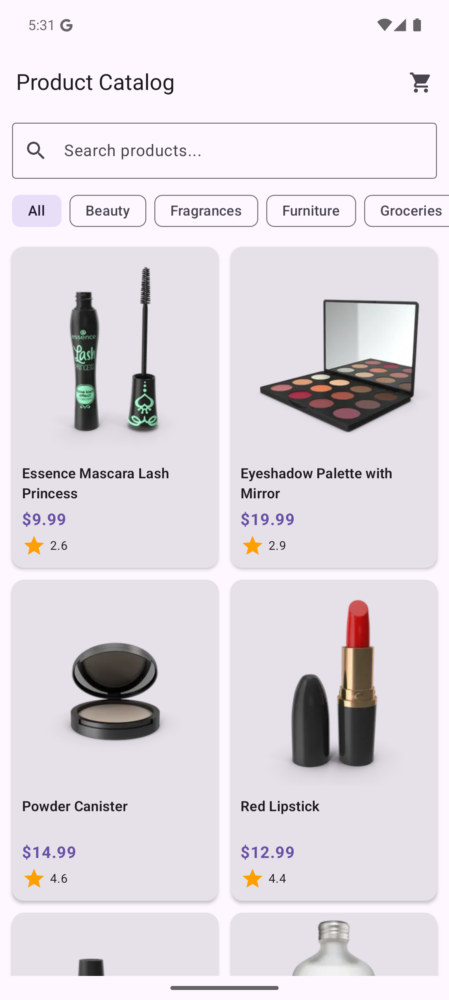
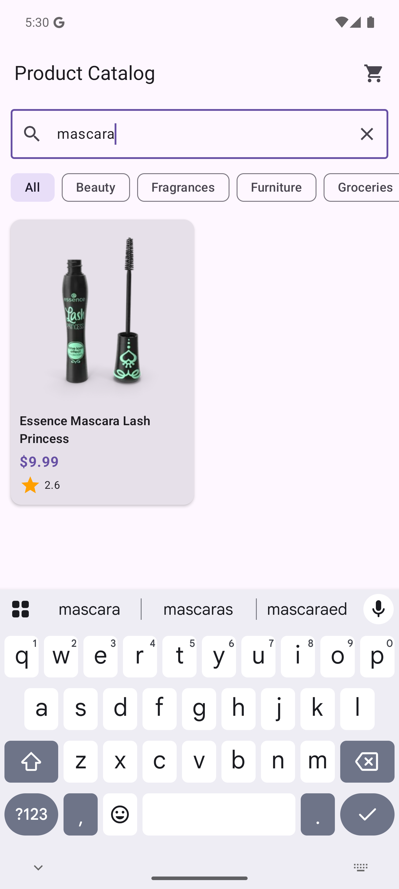
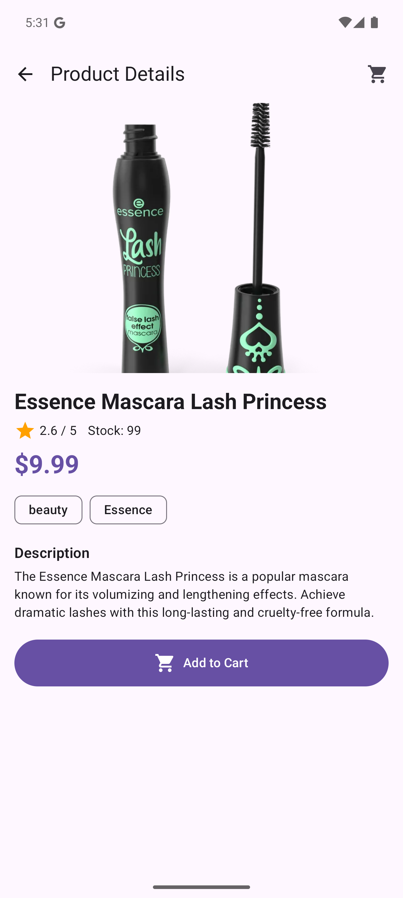
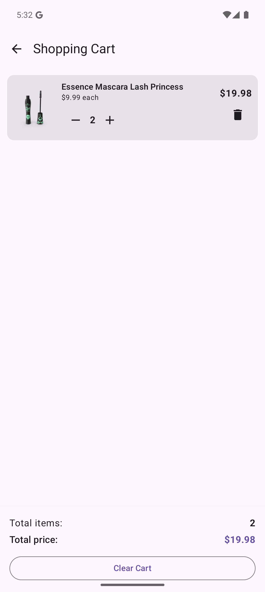
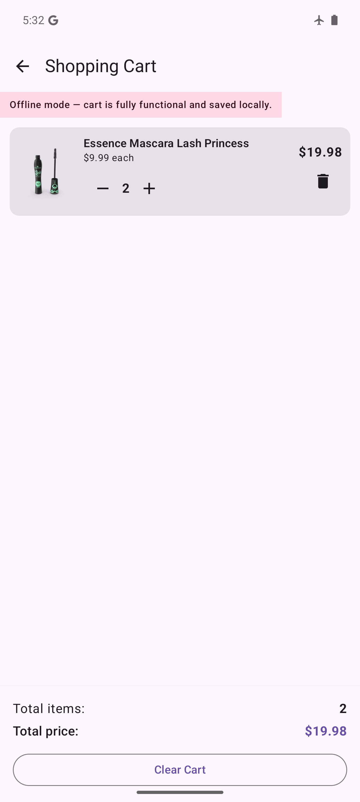
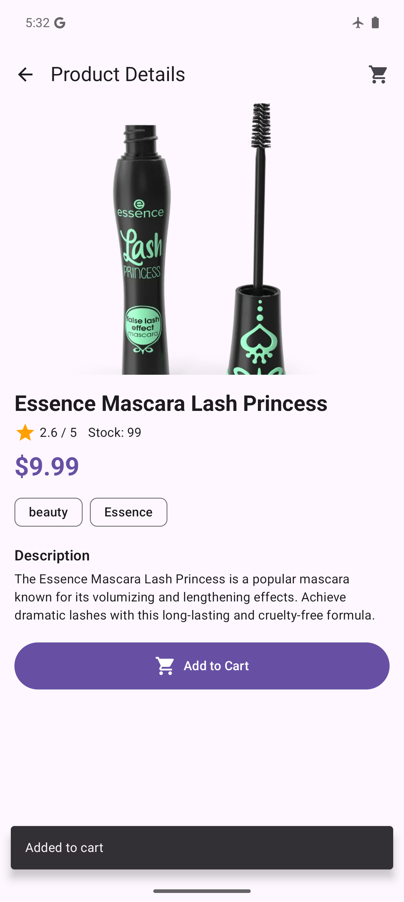

# Product Catalog & Offline Cart — Practical Assessment Submission

<div align="center">

  **SPIRE LAB, Indian Institute of Science (IISc), Bangalore**  
  *Android Developer Practical Assessment*

  [](https://developer.android.com/)
  [](https://kotlinlang.org/)
  [](https://developer.android.com/jetpack/compose)
  [](#architecture)
  [](https://developer.android.com/training/data-storage/room)
  [](https://square.github.io/retrofit/)
  [](https://gradle.org/)

</div>

---

## 📌 Submission Overview

| Field | Details |
|---|---|
| **Role** | Android Developer |
| **Organization** | SPIRE Lab, IISc Bangalore |
| **Assessment** | Product Catalog & Offline Cart |
| **Candidate** | Ashutosh Sahoo |
| **GitHub Repository** | [https://github.com/ashu-sa/ProductCatalog](https://github.com/ashu-sa/ProductCatalog) |
| **Submission Form** | [Spire Lab Assessment Submission Form](https://forms.gle/VLFtLxSwmmHzGJ4EA) |

---

## 🎯 Objective & Summary

A modern, production-grade Android application developed in **Kotlin** and **100% Jetpack Compose (Material 3)**. It consumes the [DummyJSON Products API](https://dummyjson.com/docs/products), offering real-time debounced search, category filtering, detailed product inspection, and a **Room-backed offline shopping cart**.

The cart is engineered with an offline-first contract: all cart operations (adding products, modifying quantities, removing items, clearing cart, and calculating line & order totals) work seamlessly without an active internet connection, surviving app process termination and device restarts.

---

## 📱 App Screenshots

<div align="center">

| 1. Product Catalog | 2. Debounced Search | 3. Product Details |
|:---:|:---:|:---:|
|  |  |  |
| *2-column grid with live ratings & prices* | *500ms debounced live query with empty handling* | *Full specs, stock, rating & Add to Cart* |

| 4. Shopping Cart | 5. Offline Cart Banner | 6. Add to Cart Confirmation |
|:---:|:---:|:---:|
|  |  |  |
| *Persisted items, reactive line items & totals* | *Full offline cart edits with network banner* | *Instant Snackbar confirmation on cart addition* |

</div>

---

## 🎥 Video Demonstration

- **App Walkthrough Video**: `docs/product_catalog_demo.mp4` *(or see attached Google Drive / YouTube link below)*
- **Demo Link**: *[Insert Unlisted YouTube / Google Drive Video Link Here]*

### Demonstrated Assessment Flows:
1. **Product Listing & Pagination/Filter**: Grid display showing product images, title, rating, and formatted price.
2. **Debounced Search**: Typing queries (e.g. `"mascara"`) updates the list via API without race conditions; clearing query recovers the full product set.
3. **Product Details**: Shows high-resolution image, title, rating, stock status, categories, brand, description, and "Add to Cart" with Snackbar confirmation.
4. **Shopping Cart Management**: Incrementing (`+`) and decrementing (`-`) quantity bounded by inventory stock, item deletion, and clear cart.
5. **Real-time Totals**: Total item count and total price update reactively via Room SQLite triggers.
6. **Offline Resilience (Airplane Mode)**: Toggling Airplane Mode triggers the non-intrusive offline status banner. The cart remains 100% functional (modifying quantities, viewing totals, deleting items).
7. **Process Death / Persistence**: Killing the application and relaunching verifies full state restoration from Room database.

---

## ✅ Functional Requirements Compliance Matrix

| Requirement | Specification | Implementation Details | Status |
|---|---|---|:---:|
| **1. Product Listing** | Fetch products from REST API; display image, name, price, rating; loading, empty, error, retry. | Handled via `ProductListViewModel`, Retrofit API, Coil image caching, Material 3 `ElevatedCard`. State machine covers `Loading`, `Success`, `Error`, and `Empty`. | ✅ Pass |
| **2. Product Search** | Search products with live/debounced updates based on query. | Debounced 500ms using Coroutines `delay()` inside structured `searchJob`. Cancels previous in-flight requests cleanly. Empty query restores full catalog. | ✅ Pass |
| **3. Product Details** | Detail screen displaying image, name, description, price, rating, category, brand, stock; Add to Cart. | Loaded via `GET /products/{id}`. Shows dynamic stock badge, category chips, rating indicator, and Add to Cart action with confirmation. | ✅ Pass |
| **4. Shopping Cart** | Add items, increase/decrease qty, remove item, view all items, total count and price. Persisted locally. | Backed by Room DB (`catalog_cart.db`). All mutations execute through `CartRepository` with reactive `StateFlow` updates across screens. | ✅ Pass |
| **5. Offline Support** | Cart must remain fully functional with no internet (view, edit, delete, totals). | Offline-first architecture. Price and stock snapshots stored in `CartItemEntity` so cart calculations need zero network roundtrips. | ✅ Pass |
| **6. Error Handling** | Graceful handling for no internet, API failure, timeout, empty search, empty catalog. | `AppResult` sealed hierarchy translates `UnknownHostException`, `SocketTimeoutException`, and HTTP codes into actionable user messages with `Retry`. | ✅ Pass |

---

## 🏗️ Architecture

The app follows the recommended **Android Architecture Guide (MVVM + Repository Pattern)** with **Unidirectional Data Flow (UDF)**:

```
┌─────────────────────────────────────────────────────────────────────────────┐
│                               Presentation Layer                            │
│                                                                             │
│   MainActivity (Single Activity Jetpack Compose)                            │
│   └── CatalogNavHost (Navigation Compose)                                   │
│       ├── ProductListScreen    ◄── ProductListViewModel (StateFlow)         │
│       ├── ProductDetailScreen  ◄── ProductDetailViewModel (StateFlow)       │
│       └── CartScreen           ◄── CartViewModel (Shared StateFlow)         │
└──────────────────────────────────────┬──────────────────────────────────────┘
                                       │
                                       ▼
┌─────────────────────────────────────────────────────────────────────────────┐
│                                 Domain / DI Layer                           │
│                                                                             │
│   AppContainer (Pure, deterministic manual DI in CatalogApp Application)    │
│   AppResult<T> (Sealed result hierarchy: Success<T> | Error(message))       │
│   ConnectivityManager (Reactive network Flow via registerDefaultCallback)   │
└──────────────────────────────────────┬──────────────────────────────────────┘
                                       │
                     ┌─────────────────┴─────────────────┐
                     ▼                                   ▼
┌─────────────────────────────────────────┐  ┌────────────────────────────────┐
│             Remote Data Layer           │  │        Local Data Layer        │
│                                         │  │                                │
│   ProductRepository                     │  │   CartRepository               │
│   └── Retrofit (DummyJSON REST API)     │  │   └── Room Database            │
│       └── OkHttp Client (15s timeouts,  │  │       ├── CartDao              │
│           logging interceptor)          │  │       └── CartItemEntity       │
│                                         │  │           (catalog_cart.db)    │
└─────────────────────────────────────────┘  └────────────────────────────────┘
```

### Architectural Highlights
- **Unidirectional Data Flow (UDF)**: ViewModels expose immutable `StateFlow<UiState>` to Compose UI; user events trigger ViewModel functions.
- **Structured Concurrency**: All coroutines run in `viewModelScope` with cooperative cancellation (`CancellationException` is preserved).
- **Reactive UI**: Cart modifications in Room trigger SQLite change notifications through `Flow<List<CartItemEntity>>`, automatically synchronizing the cart badge on the listing screen and the cart screen.

---

## 🛠️ Tech Stack & Libraries Used

| Area | Library / Tool | Version | Purpose |
|---|---|---|---|
| **Language** | Kotlin | `2.0.21` | Modern idiomatic language with coroutines |
| **UI Toolkit** | Jetpack Compose (BOM) | `2024.10.00` | Declarative UI toolkit |
| **Design System** | Material 3 | `1.3.0` | Latest Material Design components |
| **Navigation** | Navigation Compose | `2.7.3` | Single-activity typed navigation |
| **Lifecycle** | AndroidX Lifecycle & ViewModel | `2.8.6` | Lifecycle-aware UI state management |
| **Networking** | Retrofit | `2.11.0` | Type-safe REST client for DummyJSON API |
| **HTTP Client** | OkHttp + Logging Interceptor | `4.12.0` | Connection pooling, 15s timeouts, logging |
| **JSON Parser** | Gson + Converter | `2.11.0` | Tolerant JSON deserialization |
| **Local Storage** | Room Database (Runtime + KTX) | `2.6.1` | SQLite abstraction with Kotlin Coroutines & Flow |
| **Code Generation** | Google KSP | `2.0.21-1.0.25` | Annotation processing for Room DAOs |
| **Image Loading** | Coil Compose | `2.6.0` | Asynchronous image loading with memory/disk cache |
| **Asynchronous** | Kotlinx Coroutines Android | `1.9.0` | Non-blocking asynchronous programming |
| **Build System** | Android Gradle Plugin (AGP) | `8.7.3` | Modern Android build toolchain |
| **Target SDK** | Android 15 (API 35) | `compileSdk 35` | Compatibility: `minSdk 24` to `targetSdk 35` |

---

## 💾 Local Storage Strategy

### Room SQLite Database (`catalog_cart.db`)
The shopping cart persists in SQLite via Room using the entity schema:

```kotlin
@Entity(tableName = "cart_items")
data class CartItemEntity(
    @PrimaryKey val productId: Int,
    val title: String,
    val price: Double,
    val thumbnail: String,
    val stock: Int,
    val quantity: Int,
    val addedAt: Long
)
```

### Key Decisions for Offline Cart
1. **Price & Stock Snapshotting**: When an item is added to the cart, the unit price and available stock are persisted alongside the item. This ensures that totals (`itemCount` and `totalPrice`) are calculated directly from local SQLite data without relying on external network requests when the device is in airplane mode or offline.
2. **Reactive Flow Streaming**: `CartDao.observeItems()` returns `Flow<List<CartItemEntity>>`. Any addition, quantity update, or deletion automatically triggers a new emission that updates UI state in real time.
3. **Quantity Clamping & Stock Invariant**: Quantities are clamped to `[1, item.stock]` in both `CartRepository` and `CartViewModel`, preventing users from ordering more stock than is available. Setting quantity to `0` triggers automatic row deletion.
4. **Resilience Across Process Termination**: Because data is committed synchronously to Room SQLite, app termination (swipe away / OS eviction) preserves all items.

---

## 💡 Key Design Decisions & Trade-offs

1. **Manual Dependency Injection (`AppContainer`) over Hilt**:
   - *Rationale*: For an assessment application of this scope, a clean manual `AppContainer` instantiated in `CatalogApp` avoids excessive Hilt/Dagger annotation processor overhead, reduces compilation time, keeps the submission zero-magic, and is transparent for reviewers to inspect.
2. **Debounced Search (500 ms) with Race Condition Protection**:
   - *Rationale*: Debouncing prevents excessive API calls to DummyJSON. Structured coroutine cancellation ensures that if the user types while a request is in flight, previous jobs cancel immediately without overwriting subsequent search responses.
3. **Lenient Category Deserialization**:
   - *Rationale*: DummyJSON category endpoints occasionally alternate between string arrays (`["beauty", ...]`) and object arrays (`[{"slug":"beauty", "name":"Beauty"}]`). A custom Gson deserializer accepts both formats gracefully so changes in upstream API contracts never break the client.
4. **Network State Observer with Synchronous Init**:
   - *Rationale*: Uses Android's `ConnectivityManager.registerDefaultNetworkCallback` exposed via callbackFlow. Initial state defaults to current network capabilities to prevent temporary UI flickering of the offline banner on app start.
5. **No Full Product Cache (Intentional Scope Boundary)**:
   - *Rationale*: In accordance with the prompt guidelines ("The cart must remain available and fully functional when the device is offline"), the product catalog itself requires connectivity to fetch fresh data, while the shopping cart is completely offline-first.

---

## ⚠️ Known Limitations & Future Enhancements

- **Catalog Infinite Scrolling**: The product list currently requests up to 60 items (`limit=60`). Full Paging 3 pagination could be implemented for infinite scrolling across thousands of items.
- **Image Offline Fallback**: Images rely on Coil's disk/memory cache. Images not previously loaded prior to entering airplane mode display a clean placeholder.
- **Checkout Flow**: Per assessment requirements, only cart management and order totals are implemented; no mock payment gateway is integrated.

---

## 🚀 Setup & Build Instructions

### Prerequisites
- **JDK 17** (or Android Studio bundled JBR)
- **Android SDK** with Platform 35 and Build-Tools installed
- **Android Studio** Ladybug (2024.2.1+) or newer

### 1. Clone the Repository
```bash
git clone https://github.com/ashu-sa/ProductCatalog.git
cd ProductCatalog
```

### 2. Configure SDK Path
Ensure `ANDROID_HOME` or `ANDROID_SDK_ROOT` is exported, or create `local.properties`:
```bash
# macOS default:
echo "sdk.dir=$HOME/Library/Android/sdk" > local.properties

# Linux default:
echo "sdk.dir=$HOME/Android/Sdk" > local.properties
```

### 3. Build Debug APK
```bash
./gradlew assembleDebug
```
The compiled APK will be generated at:
```
app/build/outputs/apk/debug/app-debug.apk
```

### 4. Install & Run on Device / Emulator
```bash
./gradlew installDebug
```
Or install via ADB:
```bash
adb install -r app/build/outputs/apk/debug/app-debug.apk
adb shell am start -n com.spirelab.productcatalog/.MainActivity
```

---

## 👨‍💻 Author

**Ashutosh Sahoo**  
- GitHub: [@ashu-sa](https://github.com/ashu-sa)  
- Email: sahooashutosh222@gmail.com  
